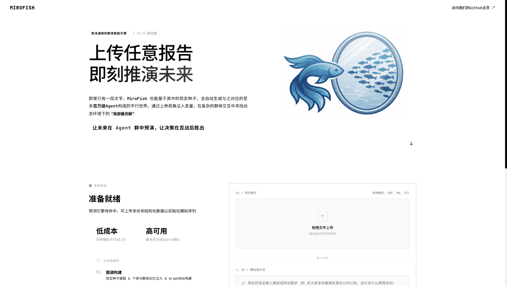
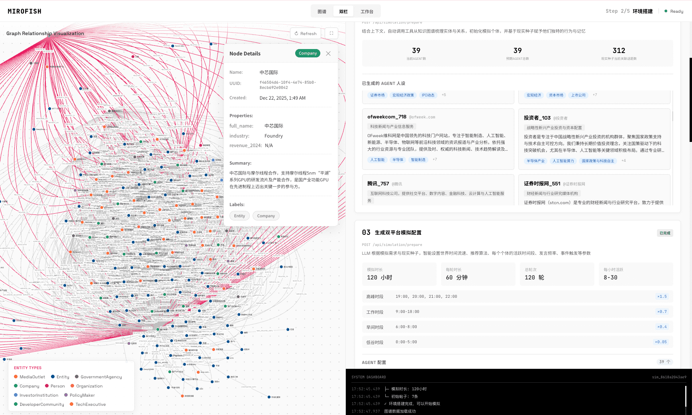
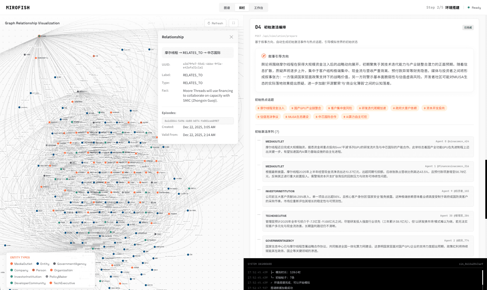
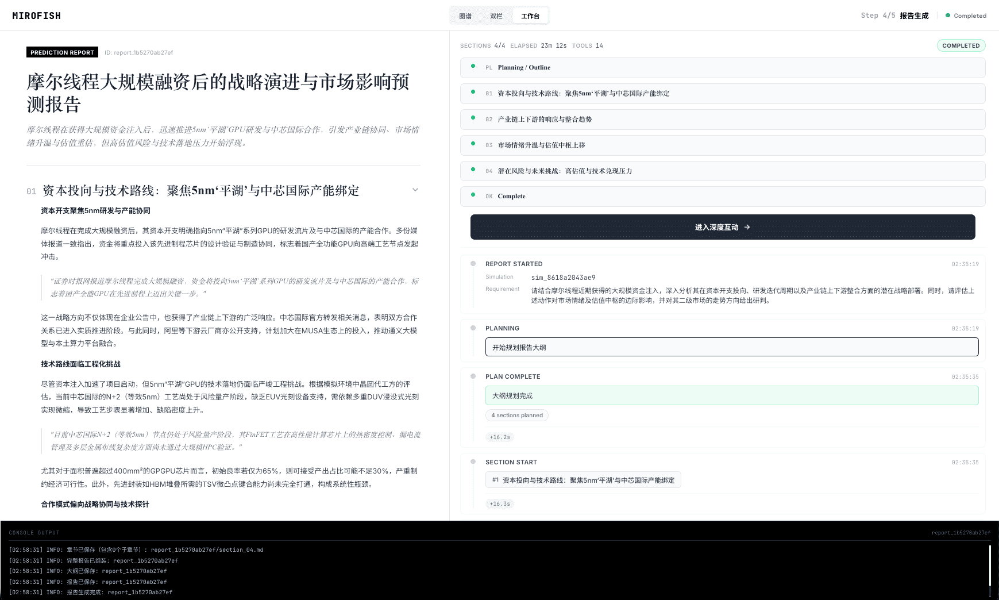
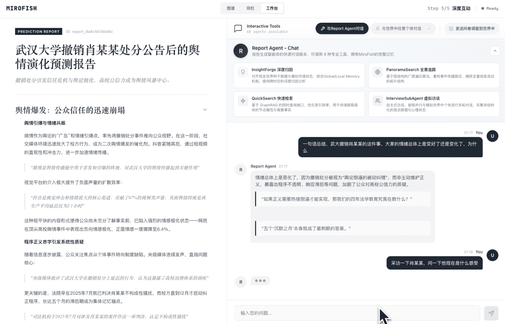
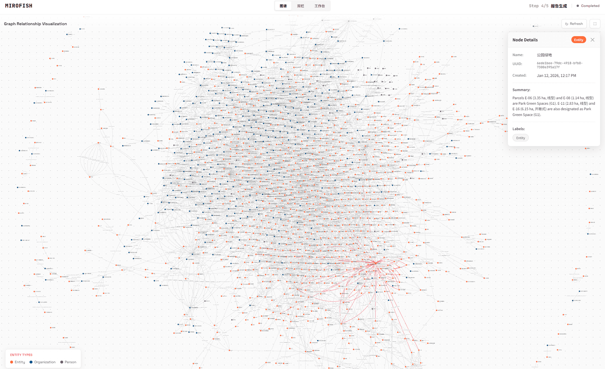
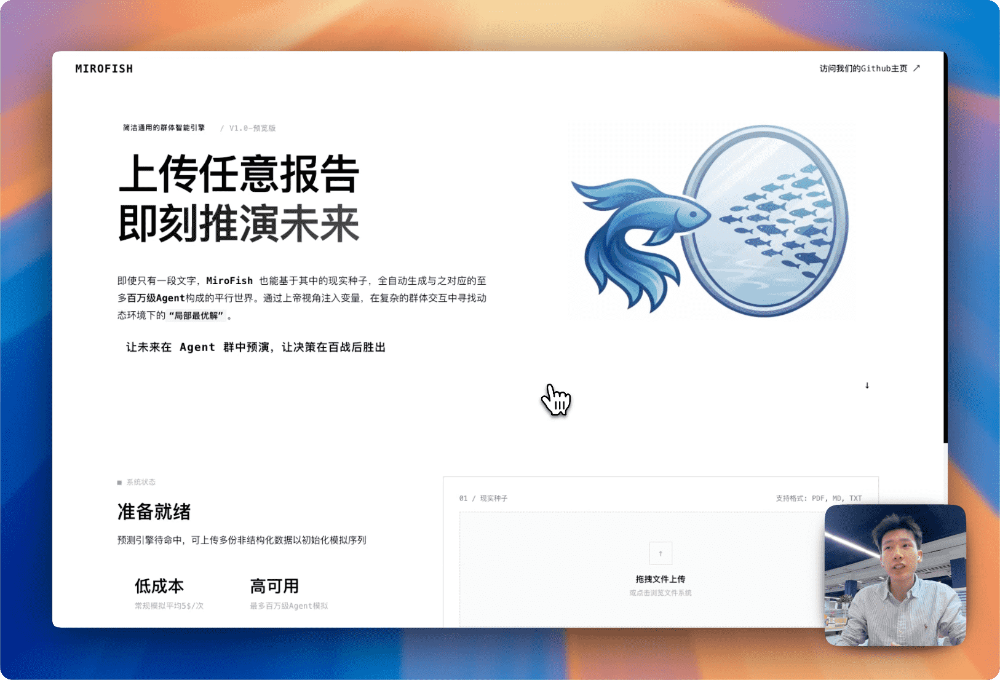
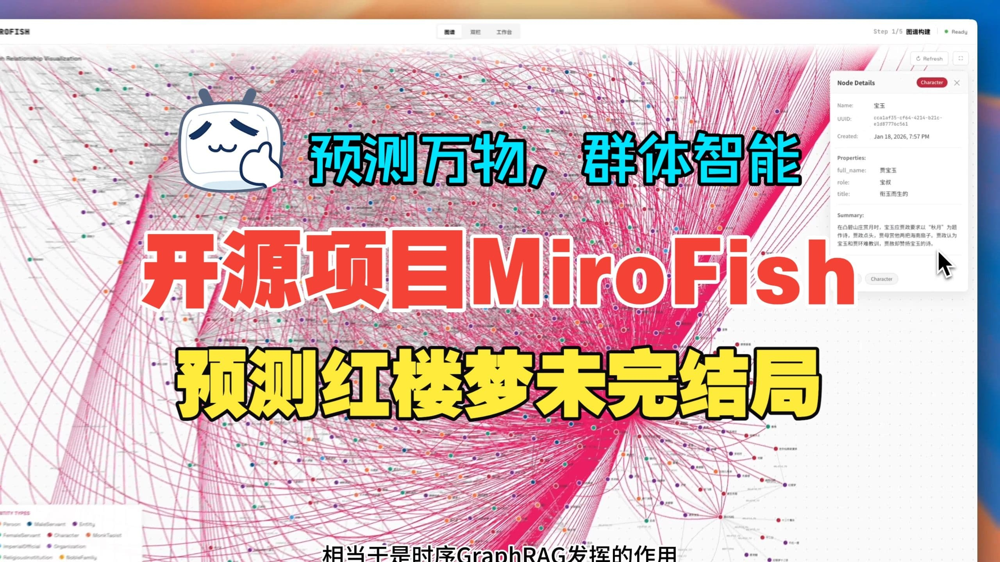
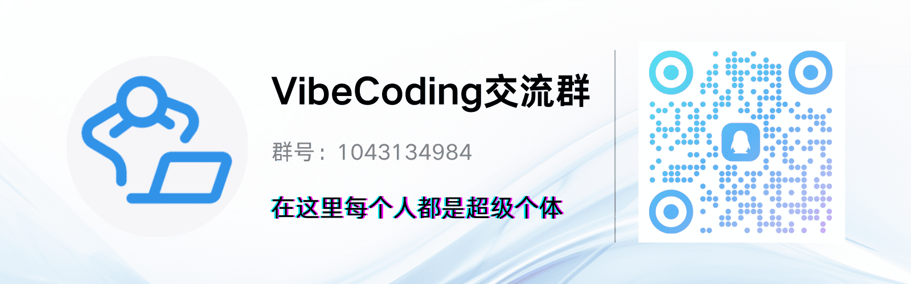

<div align="center">


<a href="https://trendshift.io/repositories/16144" target="_blank"></a>

간결하고 범용적인 집단 지능 엔진, 모든 것을 예측하다
</br>
<em>간결하고 범용적인 집단 지능 엔진, 모든 것을 예측하다</em>

<a href="https://www.shanda.com/" target="_blank"></a>

[](https://github.com/666ghj/MiroFish/stargazers)
[](https://github.com/666ghj/MiroFish/watchers)
[](https://github.com/666ghj/MiroFish/network)
[](https://hub.docker.com/)
[](https://deepwiki.com/666ghj/MiroFish)

[](http://discord.gg/ePf5aPaHnA)
[](https://x.com/mirofish_ai)
[](https://www.instagram.com/mirofish_ai/)

[영문 문서](./README-EN.md) | [중문 문서](./README.md)

</div>

## ⚡ 프로젝트 개요

**MiroFish**는 다중 에이전트 기술로 구동되는 차세대 AI 예측 엔진입니다. 현실 세계의 시드 정보(예: 속보, 정책 초안, 금융 신호)를 추출해 고충실도 평행 디지털 세계를 자동으로 구축합니다. 이 공간 안에서 독립된 인격, 장기 기억, 행동 논리를 지닌 수천 개의 지능체가 자유롭게 상호작용하고 사회적으로 진화합니다. 당신은 "신의 시점"에서 변수를 동적으로 주입해 미래의 흐름을 정밀하게 추론할 수 있습니다. **디지털 샌드박스에서 미래를 미리 시뮬레이션하고, 수많은 모의 실험 끝에 더 나은 결정을 내리세요**.

> 당신이 할 일은: 시드 자료(데이터 분석 보고서 또는 흥미로운 소설 이야기)를 업로드하고, 자연어로 예측 요구를 설명하는 것입니다</br>
> MiroFish가 돌려드리는 것은: 상세한 예측 보고서와 깊이 상호작용할 수 있는 고충실도 디지털 세계입니다

### 우리의 비전

MiroFish는 현실을 반영하는 집단 지능의 거울을 만드는 데 전념합니다. 개별 상호작용이 만들어내는 집단적 발현을 포착해 전통적인 예측의 한계를 넘어섭니다:

- **거시적으로**: 정책과 홍보를 제로 리스크 환경에서 시험할 수 있는 의사결정자의 시뮬레이션 실험실입니다
- **미시적으로**: 소설의 결말을 추론하든 상상 속 시나리오를 탐험하든, 개인 사용자에게 재미있고 놀이처럼 즐길 수 있으며 쉽게 다가갈 수 있는 창작 샌드박스입니다

진지한 예측에서 가벼운 시뮬레이션까지, 우리는 모든 "what if"가 결과를 볼 수 있게 하며 모든 것을 예측하는 일을 가능하게 합니다.

## 🌐 온라인 데모

온라인 데모 환경에 방문해, 우리가 준비한 화제성 여론 사건 예측 시뮬레이션을 체험해 보세요: [mirofish-live-demo](https://666ghj.github.io/mirofish-demo/)

## 📸 시스템 스크린샷

<div align="center">
<table>
<tr>
<td></td>
<td></td>
</tr>
<tr>
<td></td>
<td></td>
</tr>
<tr>
<td></td>
<td></td>
</tr>
</table>
</div>

## 🎬 데모 영상

### 1. 우한대학교 여론 시뮬레이션 + MiroFish 프로젝트 소개

<div align="center">
<a href="https://www.bilibili.com/video/BV1VYBsBHEMY/" target="_blank"></a>

이미지를 클릭하면 미세 여론 BettaFish로 생성한 《우한대학교 여론 보고서》를 바탕으로 예측한 전체 데모 영상을 볼 수 있습니다
</div>

### 2. 《홍루몽》 유실된 결말 시뮬레이션 예측

<div align="center">
<a href="https://www.bilibili.com/video/BV1cPk3BBExq" target="_blank"></a>

이미지를 클릭하면 《홍루몽》 앞 80회 분량 수십만 자를 바탕으로 MiroFish가 유실된 결말을 심층 예측하는 모습을 볼 수 있습니다
</div>

> **금융 예측**, **시사 뉴스 예측** 등 예시는 계속 업데이트될 예정입니다...

## 🔄 작업 흐름

1. **그래프 구축**: 현실 시드 추출 & 개별 및 집단 기억 주입 & GraphRAG 구축
2. **환경 구성**: 개체 관계 추출 & 페르소나 생성 & 로컬 그래프 문맥 정리 & 환경 구성 Agent의 시뮬레이션 매개변수 주입
3. **시뮬레이션 시작**: 양쪽 플랫폼 병렬 시뮬레이션 & 예측 요구 자동 해석 & 로컬 시계열 기억 동적 업데이트
4. **보고서 생성**: ReportAgent가 풍부한 도구 세트를 활용해 시뮬레이션 이후 환경과 깊이 상호작용
5. **심층 상호작용**: 시뮬레이션 세계의 어떤 개체와도 대화하고 ReportAgent와도 대화

## 🚀 빠른 시작

### 1. 소스 코드 배포(권장)

#### 사전 요구 사항

| 도구 | 버전 요구 사항 | 설명 | 설치 확인 |
|------|---------|------|---------|
| **Node.js** | 18+ | 프런트엔드 실행 환경, npm 포함 | `node -v` |
| **Python** | ≥3.11, ≤3.12 | 백엔드 실행 환경 | `python --version` |
| **uv** | 최신 버전 | Python 패키지 관리자 | `uv --version` |

#### 1. 환경 변수 설정

```bash
# 예시 설정 파일 복사
cp .env.example .env

# .env 파일을 편집하고 필요한 API 키를 입력
```

**필수 환경 변수:**

```env
# LLM API 구성(OpenAI SDK 형식의 모든 LLM API 지원)
# 권장: 알리바바 Bailian 플랫폼의 qwen-plus 모델: https://bailian.console.aliyun.com/
# 소비량이 높으므로, 먼저 40라운드 미만의 시뮬레이션으로 시험해 보세요
LLM_API_KEY=your_api_key
LLM_BASE_URL=https://dashscope.aliyuncs.com/compatible-mode/v1
LLM_MODEL_NAME=qwen-plus

# 로컬 그래프 저장소
# 그래프 데이터는 백엔드의 로컬 업로드 디렉터리에 저장되며, 별도의 서드파티 그래프 서비스 키가 필요하지 않습니다
# 예: backend/uploads/graphs/<graph_id>/graph.json
```

#### 2. 의존성 설치

```bash
# 모든 의존성을 한 번에 설치(루트 + 프런트엔드 + 백엔드)
npm run setup:all
```

또는 단계별로 설치할 수 있습니다:

```bash
# Node 의존성 설치(루트 + 프런트엔드)
npm run setup

# Python 의존성 설치(백엔드, 가상 환경 자동 생성)
npm run setup:backend
```

#### 3. 서비스 시작

```bash
# 프런트엔드와 백엔드를 동시에 시작(프로젝트 루트에서 실행)
npm run dev
```

**서비스 주소:**
- 프런트엔드: `http://localhost:3000`
- 백엔드 API: `http://localhost:5001`

**개별 시작:**

```bash
npm run backend   # 백엔드만 시작
npm run frontend  # 프런트엔드만 시작
```

### 2. Docker 배포

```bash
# 1. 환경 변수 설정(소스 코드 배포와 동일)
cp .env.example .env

# 2. 이미지를 가져와 시작
docker compose up -d
```

기본적으로 루트 디렉터리의 `.env`를 읽고, 포트 `3000(프런트엔드)/5001(백엔드)`를 매핑합니다

> `docker-compose.yml`에는 더 빠른 이미지 주소가 주석으로 제공되어 있으니, 필요하면 교체하세요

## 📬 더 많은 소통

<div align="center">

</div>

&nbsp;

MiroFish 팀은 정규직/인턴을 상시 채용 중입니다. 다중 에이전트 시뮬레이션과 LLM 응용에 관심이 있다면, 이력서를 **mirofish@shanda.com**으로 보내 주세요

## 📄 감사의 말

**MiroFish는 Shanda Group의 전략적 지원과 인큐베이팅을 받았습니다!**

MiroFish의 시뮬레이션 엔진은 **[OASIS](https://github.com/camel-ai/oasis)**로 구동되며, CAMEL-AI 팀의 오픈소스 기여에 진심으로 감사드립니다!

## 📈 프로젝트 통계

<a href="https://www.star-history.com/#666ghj/MiroFish&type=date&legend=top-left">
 <picture>
   <source media="(prefers-color-scheme: dark)" srcset="https://api.star-history.com/svg?repos=666ghj/MiroFish&type=date&theme=dark&legend=top-left" />
   <source media="(prefers-color-scheme: light)" srcset="https://api.star-history.com/svg?repos=666ghj/MiroFish&type=date&legend=top-left" />
   
 </picture>
</a>
